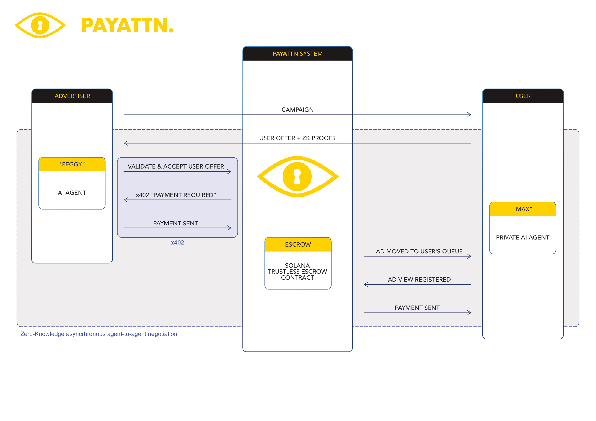

# PayAttn


**Autonomous Agents Negotiate Ad Prices and Settle Payments using Solana & x402**

PayAttn uses two personalised AI agents to negotiate ad prices on behalf of individual users. Max (the user's agent) and Peggy (advertiser's agent) automatically agree on fair payment for your attention, then settle transactions using x402 payments and Solana escrow. Private, trustless, efficient. No tracking, no data harvesting, no surveillance.

## The Problem

Online advertising is broken. The current model doesn't work for users or publishers. It is optimised for ad networks that have built empires on surveillance and data harvesting. PayAttn shifts power back to users while still giving advertisers and publishers a fair deal.

---

[](https://github.com/payattn/payattn/actions)
[](https://github.com/payattn/payattn/actions/workflows/test.yml) [](https://solana.com/x402/hackathon)


---

## How It Actually Works

**Two autonomous agents negotiate 24/7**

1. **User's agent (Max)** Max is the gatekeeper to the user's attention. If he thinks an ad will add value to their user, he sets the price the advertiser must pay. He justifies the price by sending encrypted proof of the user's value to the advertiser. This is sent to the advertiser as an "offer"
2. **Advertiser's agent (Peggy)** evaluates offers from users and decides to accept or reject each one
3. **Agents negotiate automatically** - no human intervention required
4. **Solana smart contracts settle payments instantly** - trustless escrow transfers SOL as soon as the ad has been viewed
5. **Zero surveillance** - user data never leaves the browser, enforced by ZK-SNARK cryptography. No surveillance by publishers, advertiser or network.

**The novel part:** Autonomous price negotiation between agents, backed by cryptographic privacy guarantees and automatic blockchain settlement.

---

## Key Technical Achievements

- **Autonomous Agent Negotiation:** Two LLM-powered agents (Max & Peggy) negotiate prices automatically
- **x402 Protocol:** HTTP status code for "payment required" is used to transfer advertiser funds into escrow
- **Real ZK-SNARKs:** Groth16 proofs with Circom circuits enable privacy-preserving negotiation
- **10-50ms Verification:** Rapidsnark C++ verifier validates proofs in real-time
- **Solana Smart Contracts:** Trustless escrow automatically settles agreed prices
- **Privacy-Preserving Architecture:** User data never leaves browser, cryptographically guaranteed
- **Complete End-to-End Flow:** Chrome extension  Agent negotiation  ZK proof  Solana settlement

---

## Quick Links

- **[Documentation](/docs)** - Complete system documentation
- **[Architecture](/docs/ARCHITECTURE.md)** - System overview and components
- **[ZK Proof Flow](/docs/ZK_PROOF_FLOW.md)** - How proofs work
- **[Backend Verification](/docs/BACKEND_VERIFICATION.md)** - Rapidsnark setup
- **[API Reference](/docs/API.md)** - API endpoints
- **[Testing Guide](/docs/TESTING.md)** - Testing procedures

---

## Solana x402 Hackathon demo video

[](https://www.youtube.com/watch?v=CbyV_rnU0tA)

---

## Quick Start

### One-Command Setup
```bash
# Clone and setup (installs all dependencies)
git clone https://github.com/payattn/payattn.git
cd payattn
./setup.sh
```

### Configure Environment Variables
```bash
# 1. Backend configuration
cp backend/.env.example backend/.env.local
# Edit backend/.env.local with your Supabase and Solana credentials

# 2. Advertiser agent configuration (optional)
cp advertiser-agent/.env.example advertiser-agent/.env
# Edit advertiser-agent/.env with your Venice AI key if you don't want to run Max using a local LLM
```

### Start the System
```bash
# Terminal 1: Start backend server
cd backend
npm run dev
# Server runs at http://localhost:3000

# Terminal 2 (optional): Start advertiser agent
cd advertiser-agent
npm start
```

### Load Chrome Extension
1. Open Chrome  `chrome://extensions/`
2. Enable "Developer mode"
3. Click "Load unpacked"
4. Select `extension/` directory

**That's it!** The extension will guide you through generating ZK proofs.

---

## Quick Start (Development)

### Prerequisites
- Node.js 18+
- Chrome (for extension development)
- macOS/Linux (for Rapidsnark compilation ...I used a docker container on MacOS)
- LLM (local LMstudio etc supported) but can use venice.ai too

### 1. Clone Repository
```bash
git clone https://github.com/payattn/payattn.git
cd payattn
```

### 2. Install Dependencies
```bash
cd backend
npm install
```

### 3. Set Up Rapidsnark (Backend Verification)
```bash
cd ../rapidsnark-server
# Follow instructions in rapidsnark-server/README.md
```

### 4. Start Development Server
```bash
cd ../backend
npm run dev
# Server runs at http://localhost:3000
```

### 5. Load Chrome Extension
1. Open Chrome  `chrome://extensions/`
2. Enable "Developer mode"
3. Click "Load unpacked"
4. Select `extension/` directory (at root level, NOT in backend)

---

## Project Structure

```
payattn/
 docs/                          # Documentation
    README.md                  # Documentation index
    ARCHITECTURE.md            # System architecture
    ZK_PROOF_FLOW.md          # ZK-SNARK proof lifecycle
    BACKEND_VERIFICATION.md    # Rapidsnark setup & usage
    API.md                     # API reference
    TESTING.md                 # Testing guide

 backend/                       # Next.js backend + dashboard
    app/                       # Next.js 16 App Router
       api/                   # API routes
          verify-proof/     # POST /api/verify-proof
          k/                 # GET/PUT /api/k/{hash}
       advertisers/           # Advertiser dashboard
       dashboard/             # User dashboard
    lib/                       # Utilities
       zk/                    # ZK verification logic
           verifier.ts        # Rapidsnark integration
           circuits-registry.ts

 extension/                     # Chrome Extension (Max agent)
    manifest.json              # Manifest V3
    background.js              # Service worker
    content.js                 # Content script
    popup.html/js              # Extension popup
    crypto-utils.js            # ZK proof generation
    node_modules/              # Extension dependencies (separate)
    circuits/                  # Circom circuits
        range_check.circom
        age_range.circom
        set_membership.circom

 advertiser-agent/              # Autonomous AI agent (Peggy)
    peggy.js                   # Main agent orchestrator
    lib/                       # Agent utilities
        llm.js                 # Venice AI integration
        api.js                 # x402 protocol client
        escrow.js              # Solana escrow funding

 solana/                        # Solana smart contracts
    payattn_escrow/           # Trustless escrow program
        programs/              # Anchor program
        tests/                 # Integration tests
        schema.sql             # Database schema

 rapidsnark-server/             # C++ verification server
     rapidsnark/                # Compiled Rapidsnark binary
        package_macos_arm64/
            bin/verifier       # CLI verifier (426KB)
     keys/                      # Verification keys (JSON)
        range_check_verification_key.json
        age_range_verification_key.json
        set_membership_verification_key.json
     README.md                  # Rapidsnark setup guide
```

---

## How Agent Negotiation Works



### 1. Advertiser Agent Makes Offers
```
Peggy (advertiser agent) runs continuously:
   
Scans for users matching campaign criteria
   
Evaluates each user's fit using LLM
   
Makes price offers via x402 HTTP responses
   
Funds Solana escrow for accepted offers
```

### 2. User Agent Evaluates Offers
```
Max (user agent) receives x402 response with offer:
   
Extracts: campaign_id, amount, escrow_address
   
Evaluates whether price is acceptable
   
Generates ZK proof if accepting offer
   
Submits proof + escrow signature
```

### 3. Privacy-Preserving Negotiation
```
User attributes (age, interests) stored locally:
   
Max generates ZK-SNARK proof: "Age is 25-50"
   
Backend verifies proof with Rapidsnark (10-50ms)
   
Proof validates without revealing actual age
   
Solana escrow settles payment automatically
```

### 4. Why This Matters
- **Agents negotiate automatically** - no user interaction needed
- **Fair pricing enforced** - both parties must agree before payment
- **Privacy guaranteed** - ZK proofs prevent data extraction
- **Trustless settlement** - Solana smart contracts eliminate intermediaries
- **Real-time operation** - sub-100ms negotiation cycle

---

## Technology Stack

| Component | Technology |
|-----------|-----------|
| **Max Agent** | Chrome Extension (Manifest V3), LLM integration |
| **Peggy Agent** | Node.js, Venice AI, x402 protocol client |
| **Privacy Layer** | Circom 2.0, Groth16 ZK-SNARKs, Rapidsnark C++ verifier |
| **Settlement** | Solana Web3.js, Anchor smart contracts |
| **Backend** | Next.js 16, TypeScript, Node.js 18+ |
| **Storage** | IndexedDB (browser), PostgreSQL (backend) |

---

## Current Status

**Agent Negotiation:** Fully autonomous, real-time price agreement  
**ZK Privacy:** 3 circuits working, 10-50ms verification  
**Solana Escrow:** Trustless settlement operational  
**Performance:** Production-ready agent infrastructure  

---

## Testing

See [docs/TESTING.md](/docs/TESTING.md) for complete testing guide.

**Quick test:**
```bash
# 1. Generate proof in extension (age-proof-test.html)
# 2. Verify proof:
curl -X POST http://localhost:3000/api/verify-proof \
  -H "Content-Type: application/json" \
  -d @proof.json

# Expected: {"valid": true, "verificationTime": 47}
```

---

## Documentation

All documentation is in the [`/docs`](/docs) directory:

- **[README.md](/docs/README.md)** - Documentation index
- **[ARCHITECTURE.md](/docs/ARCHITECTURE.md)** - System architecture and data flow
- **[ZK_PROOF_FLOW.md](/docs/ZK_PROOF_FLOW.md)** - Complete ZK-SNARK lifecycle
- **[BACKEND_VERIFICATION.md](/docs/BACKEND_VERIFICATION.md)** - Rapidsnark implementation
- **[API.md](/docs/API.md)** - API endpoints and usage
- **[TESTING.md](/docs/TESTING.md)** - Testing procedures

---

## Contributing

1. Read [docs/ARCHITECTURE.md](/docs/ARCHITECTURE.md) to understand the system
2. Check [docs/ZK_PROOF_FLOW.md](/docs/ZK_PROOF_FLOW.md) for ZK-SNARK details
3. Follow TypeScript/ESLint standards
4. Update documentation for any architectural changes

---

## License

MIT License - see [LICENSE](LICENSE) file for details

---

## Links

- **Documentation:** [/docs](/docs)
- **Extension:** [/extension](/extension)
- **Backend:** [/backend](/backend)
- **Rapidsnark:** [/rapidsnark-server](/rapidsnark-server)

---

**Built with privacy-first principles. Your data stays yours. Always.**
